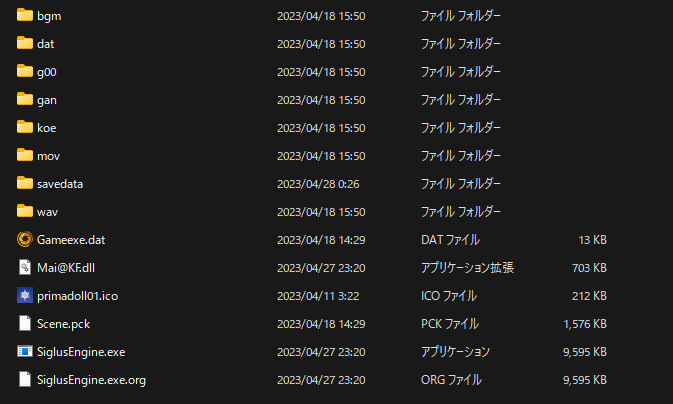
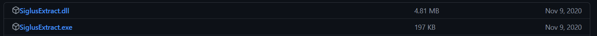
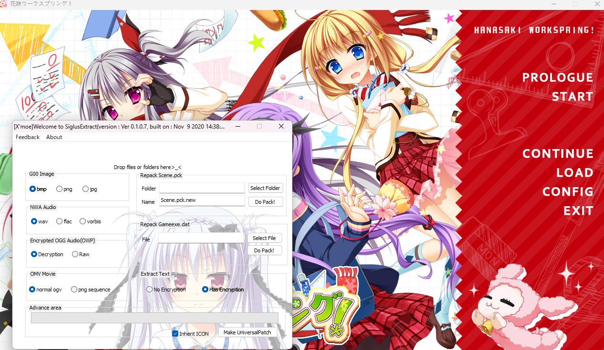
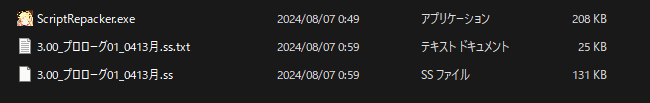
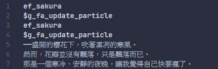
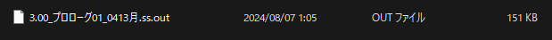
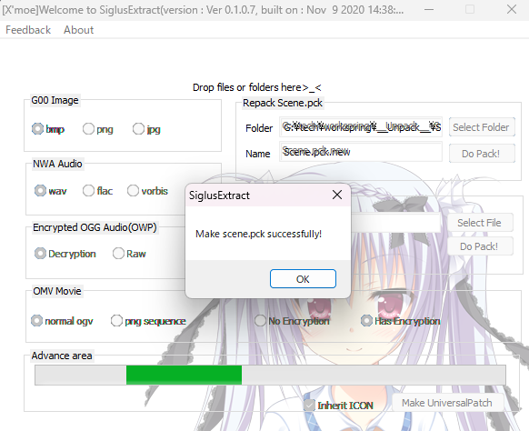
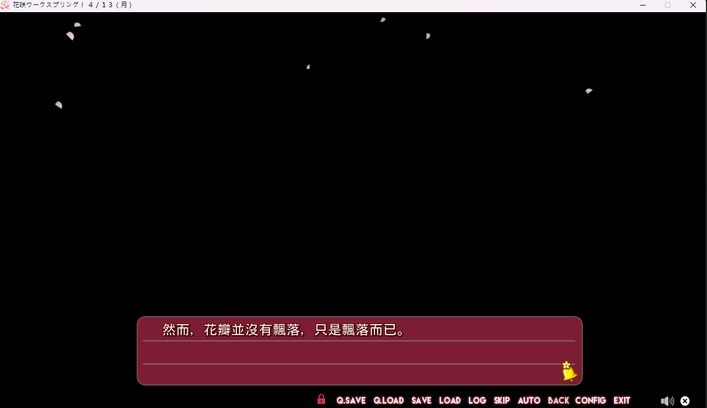

# SiglusEngine-research

## SiglusEngine 初步認識

### 架構



🔼 以天籟人偶為例
___

### Tree

```plaintext
.
├── bgm
│   ├── BGM001.nwa
│   └── ...
├── dat
│   ├── NotoSerifJP-Black.otf
│   └── ...
├── g00
│   ├── __sys_cf_msfilter00.g00
│   └── ...
├── gan
│   ├── ef_em21.gan
│   └── ...
├── koe
│   ├── z0301.ovk
│   └── ...
├── mov
│   ├── ED01.omv
│   └── ...
├── savedata
│   ├── config.sav
│   ├── system.ini
│   ├── window.ini
│   └── ...
├── wav
│   ├── ARM_TOUCH1.nwa
│   └── ...
├── Gameexe.dat
├── Mai@KF.dll
├── primadoll01.ico
├── Scene.pck
├── SiglusEngine.exe
├── SiglusEngine.exe.org
└── SiglusEngine.log
```

遊戲目錄的樹狀圖長這樣，基本上除了有些微檔案有差異外，最主要就是 __Gameexe.dat__, __SiglusEngine.exe__, __Scene.pck__，有這三個檔案基本上一定是SiglusEngine

## 工具介紹

* [SiglusExtract](https://github.com/xmoezzz/SiglusExtract)
一個專門用來提取Siglus引擎資源的工具，基本上拆包操作都會使用這個軟體進行，不過該軟體已經四年沒更新，期望往後有新的專家出來維護該專案。

___

__因為天籟人偶拆包有點問題所以換成 _花咲workspring！_ 來測試__

## Scene.pck

### 拆包



將下載的兩個檔案丟進遊戲目錄並把 __SiglusEngine.exe__ 拖曳到 __SiglusExtract.exe__ 上:



再將 __Scene.pck__ 直接拖曳到 __SiglusEngine.exe__ 介面上就可以了
會得到一個 __\_\_Unpack\_\___ 資料夾，裡面會有 __Scene__ 存放所有文本檔案，主要關注副檔名為 __.ss__ 的檔案

修改文本會需要[ScriptRepacker](https://github.com/xmoezzz/SiglusExtract/blob/master/tools/ScriptRepacker.exe)這個工具，下載後與想改的文件( __.ss.txt__ 以及 __.ss__)移動到同一個目錄



更改 __.ss.txt__ 的文檔



修改完後將兩個檔案拖曳到 __ScriptRepacker.exe__ 上，__成功會生成.ss.out文件__

將原本的.ss文件刪除，將 __.ss.out__ 文件後的 __.out__ 去除，與 __.ss.txt__ 兩個檔案覆蓋回原本資料夾裡



### 封包

在 __SiglusEngine.exe__ 的介面中的Repack Scene.pck上選選擇剛剛導出來 __Scene__ 資料夾，按 __Do pack!__ 等到他跑好就可以了



之後將產生出來的 __Scene.pck.new__ 改名為 __Scene.pck2__

點擊右下角的 __Make UniversalPatch__ 生成啟動文件，會生成 __SiglusUniversalPatch.dll__ 以及 __SiglusEngine_Patch.exe__，點擊 __SiglusEngine_Patch.exe__ 啟動遊戲就可以了

